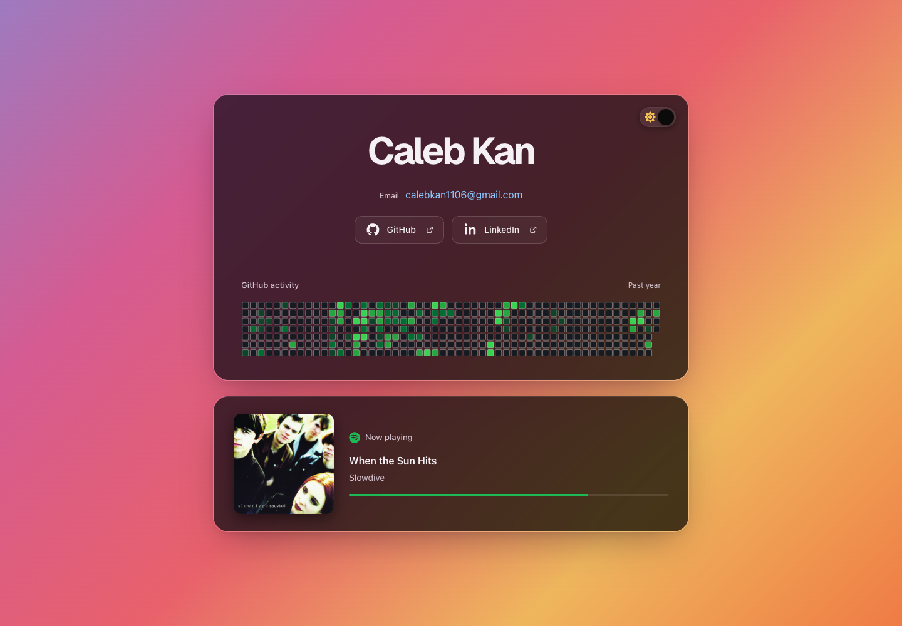
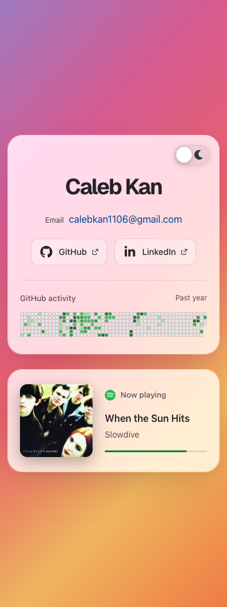

# Site maintenance audit, October 7, 2026

The review covered the complete tracked application: React rendering and
hydration, CSS and responsive layout, themes, contribution calendar, Spotify
playback and polling, authorization callback, both APIs, Worker routing and
headers, Vite configuration, public assets, dependencies, and CI/deployment
configuration. Three agents audited independent areas, followed by independent
reviews of the combined fixes.

## Confirmed defects and fixes

| Area                   | Reproduced failure                                                                                                      | Fix and regression evidence                                                                                                                                                                        |
| ---------------------- | ----------------------------------------------------------------------------------------------------------------------- | -------------------------------------------------------------------------------------------------------------------------------------------------------------------------------------------------- |
| Calendar API           | Invalid counts, impossible dates, and duplicate days were accepted and cached as successful responses.                  | Reject invalid data before warm or edge caching. Tests verify rejection, no cache write, and recovery on the next request.                                                                         |
| Calendar client        | Impossible and duplicate dates were accepted, creating missing or overwritten daily counts.                             | Validate real dates and uniqueness, retaining valid leap days and zero counts.                                                                                                                     |
| Spotify API            | Malformed playback flags silently became paused playback; invalid milliseconds could serialize as null or pass through. | Require a boolean playback flag and safe, nonnegative integer milliseconds while retaining nullable defaults.                                                                                      |
| Spotify artwork        | A blank candidate could mask a usable larger or dimensionless artwork URL.                                              | Skip blank URLs and invalid dimensions before selecting existing size fallbacks.                                                                                                                   |
| Spotify metadata       | Later polls for the same song URL retained old title, artist, artwork, and alt text.                                    | Refresh changed metadata while preserving unchanged object identity and failed-art suppression. Browser coverage verifies short-to-long-to-short updates, marquee measurement, and focus recovery. |
| Local-track identity   | `A-B` by `C` and `A` by `B-C` shared one identity, skipping the new-track progress reset.                               | Encode the title and artist as a JSON tuple. A regression verifies distinct identities and instant progress reset.                                                                                 |
| Progress accessibility | The progress helper announced `3:20 of 3:00` while displaying a full bar.                                               | Clamp visual progress and elapsed announcements to the same zero-to-duration range.                                                                                                                |
| Authorization callback | Same-origin resource requests included the authorization code and state in their Referer headers.                       | Apply `no-referrer` before resource tags. Browser tests inspect complete transmitted headers; removing the policy reproduces the leak in both browsers.                                            |
| Dependencies           | The installed development tree contained vulnerable Sharp and source-map-js versions.                                   | Patch Sharp to 0.35.5 through a scoped Miniflare override and source-map-js to 1.2.2 through the lockfile. Clean installation and npm audit pass.                                                  |

The dependency findings were verified against the
[Sharp advisory](https://github.com/advisories/GHSA-wq5f-xc86-pv6w) and
[source-map-js advisory](https://github.com/advisories/GHSA-68fv-2mgg-jv7q).
They concern development and CI tooling; the audit did not establish a
production endpoint exploit. The override preserves the installed Cloudflare
tooling because Miniflare still pins the affected Sharp release.

## Verification

- Clean `npm ci` with Node 24.19.0.
- `npm run check`: formatting, generated Worker types, strict TypeScript,
  production build, and 120 unit/build tests.
- `npx wrangler deploy --dry-run`: generated deployment configuration and
  isolated public assets.
- `npm run test:browser`: 154 Chromium/WebKit tests with no retries.
- `npm audit`: zero reported vulnerabilities across all severities.
- `actionlint`, registry integrity checks for changed dependencies, native
  Sharp image processing, and `git diff --check`.
- Both themes at 1440, 1101, 1100, 769, 768, 601, 600, 375, and 320 pixels;
  enlarged text, reduced motion, contrast, keyboard focus, stable theme
  geometry, first-load surfaces, calendar loading/error/recovery, and Spotify
  appearance/hiding and metadata updates.
- Callback success/error/no-code states, safe text rendering, exact callback
  path, credential referrers, narrow reflow, and development CSP/HMR.
- No-JavaScript portfolio content, API method restrictions and CORS, security
  headers, cache lifetime and failures, concurrent token/cache requests,
  timeouts, visibility changes, cleanup, unsafe playback URLs, and private-path
  rejection.
- Live canonical site in Chrome after automatic Cloudflare verification, live
  Worker APIs, and the apex 308 redirect preserving path and query.

The existing styling and theme/rendering architecture remain intact. The
screenshots below show the patched local production preview using live service
data. These audit files are outside `public/` and are not published as site
assets.

## Operational boundaries

Cloudflare Under Attack Mode remains enabled. Automated command-line probes of
the canonical host can receive a challenge; a normal Chrome visit completed
verification and loaded the calendar and Spotify with no console warnings or
errors. No redirect or security-challenge configuration was changed.

Spotify credentials still require operator maintenance. Its documented
[refresh-token lifecycle](https://developer.spotify.com/documentation/web-api/tutorials/refreshing-tokens)
requires reauthorization after six months, and rotated credentials must be
replaced securely in Cloudflare secrets. This is now documented in the README.

These checks establish the tested behavior at this commit. External services,
credential lifetimes, and future browser/provider changes remain outside a
finite test suite's guarantees.
