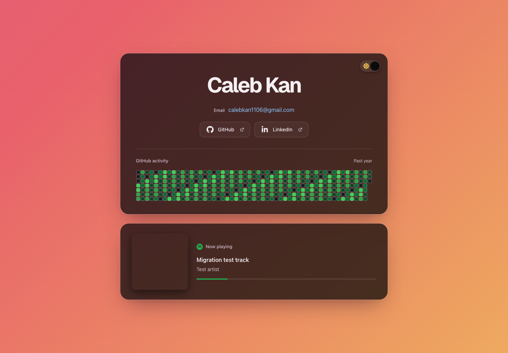
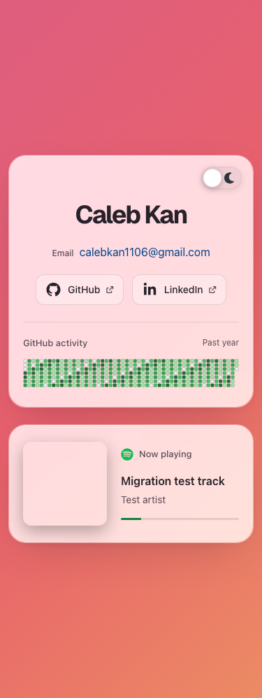

# Project audit, October 9, 2026

The audit reviewed the complete tracked application at
`9a7d6187829dc124b97b597f0659f7240758d28b`. Three agents reviewed separate
backend, frontend, and tooling areas. The combined patch received independent
correctness, maintainability, comment, and runtime reviews using the installed
PStack, Ponytail full, and Thermo-Nuclear guidance.

## Confirmed defects and fixes

| Area                   | Reproduced failure                                                                                                                                                              | Correction and regression evidence                                                                                                                                                                                |
| ---------------------- | ------------------------------------------------------------------------------------------------------------------------------------------------------------------------------- | ----------------------------------------------------------------------------------------------------------------------------------------------------------------------------------------------------------------- |
| Spotify token refresh  | Missing, malformed, or overflowing `expires_in` values were coerced into a guessed lifetime or could corrupt the shared token expiration.                                       | Require positive safe integer seconds and a safe millisecond expiration before updating the cache. Eight cases verify rejection, private errors, no playback request, and recovery through a fresh token request. |
| GitHub cache freshness | Refilling an edge cache after 30,001 milliseconds advertised another 30 seconds, extending the original freshness deadline.                                                     | Round the remaining whole seconds down. The Worker regression checks the fractional-second refill and refresh at the original expiration.                                                                         |
| Spotify keyboard focus | A playing track becoming a local track or losing its safe link removed the focused anchor's `href`. Chromium moved focus to the body; WebKit retained focus on an inert anchor. | Rescue focus to the page heading before updating the link. Browser tests cover missing and unsafe URLs, preserve focus across valid link updates, and keep a focused scrolling control available.                 |
| Browser test servers   | Local tests accepted any responding server on the configured ports without running the preview or development command.                                                          | Reject occupied ports in both environments. A reproduction with the actual Playwright server plugin verifies rejection for both configured commands.                                                              |

Spotify documents `expires_in` as the numeric lifetime in a successful token
response in its [authorization code flow](https://developer.spotify.com/documentation/web-api/tutorials/code-flow).
The fix removes the unsupported guessed lifetime instead of adding a second
token policy. Existing token sharing, 401 recovery, retry cooldowns, and
playback caching rules remain in their established handlers.

## Coverage and verification

The baseline passed a clean installation, `npm run check` with 120 unit/build
tests, and 154 Chromium/WebKit browser tests under Node 24.19.0. New regressions
failed against the baseline before their corresponding fixes.

The final patch passed:

- `npm run check`, including Prettier, generated Worker types, all strict
  TypeScript configurations, the production build, and 128 unit/build tests.
- `npm run test:browser`, with 160 Chromium/WebKit tests and no retries.
- `npx wrangler deploy --dry-run`, using the generated deployment configuration
  and isolated browser assets.
- `npm audit`, with zero reported vulnerabilities, plus `actionlint` and
  `git diff --check`.
- Direct dependency and lockfile consistency checks, plus native Sharp image
  encoding and decoding.

The review and existing regression suite cover React prerendering and
hydration, StrictMode effect disposal, theme boot and both toggle directions,
calendar validation and summaries, request/body deadlines, hidden-tab polling,
cache freshness and shared requests, token identity during delayed 401s,
rate-limit recovery, metadata updates, artwork fallbacks, progress
accessibility, URL validation, marquee behavior, and focus recovery.

Browser coverage includes light and dark themes at 1440, 1101, 1100, 769, 768,
601, 600, 375, and 320 pixels, enlarged text, reduced motion, contrast, stable
geometry, calendar errors and recovery, Spotify appearing and hiding,
no-JavaScript content, callback states and referrer privacy, development CSP
and HMR, production headers, API methods and CORS, and private-path rejection.
The existing design and stack are preserved.

The screenshots show the patched production preview using the existing test
fixtures for contributions, song metadata, and placeholder artwork. They are
simulated playback evidence, not a record of live listening activity.

## Live and operational boundaries

Before the release, a normal Chrome visit completed automatic Cloudflare
verification and rendered the canonical site and calendar without console
warnings or errors. Direct Worker probes confirmed both APIs, private-path
404s, method restrictions, CORS, cache policies, and security headers. The apex
returned 308 to the canonical host with its path and query preserved and no
challenge header.

Cloudflare management reads were unavailable. The installed MCP tools returned
`Unexpected response type`, Wrangler lacked current API authentication, and
the dashboard required sign-in. This audit therefore does not claim a fresh
inspection of zone settings, stored credentials, or account build settings.
Existing Under Attack Mode and redirect configuration were preserved.

Finite tests establish the behavior exercised here. They cannot prove every
possible future browser, provider, credential, or external-service state.
